# Multi-Source Heterogeneous Data-Driven Job Competency Graph Construction and Dynamic Evolution Analysis System

> iFlytek "Challenge Cup" Competition Entry | Topic XH-202621  
> Domain: Next-Generation Information Technology (AI, Big Data, Intelligent Systems, IoT)

---

## Overview

An **enterprise-grade AI-powered intelligent recruitment management platform** built around a Neo4j knowledge graph, integrating LLM (MiniMax), ML.NET machine learning, multi-agent collaboration, and Graph RAG technologies. It delivers end-to-end intelligent recruitment management — from job posting and resume submission to AI interviews, smart screening, and talent graph analytics.

Three user portals:
- **Candidate Portal** — Browse jobs, submit resumes, take AI interviews, view recommendations
- **HR / Interviewer Portal** — Job management, resume screening, interview scheduling, talent analytics
- **Admin Portal** — System configuration, data monitoring, compliance auditing, template management

---

## Architecture

```
+-------------------------------------------------------------------+
|                     Frontend (Vue 3 + Vite)                        |
|  Candidate / HR / Admin / Interview Pages / Graph Visualization    |
+-------------------------------------------------------------------+
|                    API Gateway (.NET 9 Web API)                    |
|  JWT Auth / SignalR Realtime / File Upload / 33+ Controllers      |
+----------+----------+----------+----------+------------------------+
| Neo4j    | SQL      | Redis    | MinIO    | Hangfire               |
| KG       | Server   | Cache    | Storage  | Scheduled Jobs          |
+----------+----------+----------+----------+------------------------+
|                        AI & ML Engine                              |
|  MiniMax LLM | ML.NET | Multi-Agent | Graph RAG | Behavior (TF.js) |
+-------------------------------------------------------------------+
```

---

## Screenshots

> Screenshots are stored under `docs/screenshots/`.  
> Recommended resolution: 1920x1080, PNG format.

### Candidate Portal

#### Job Browsing
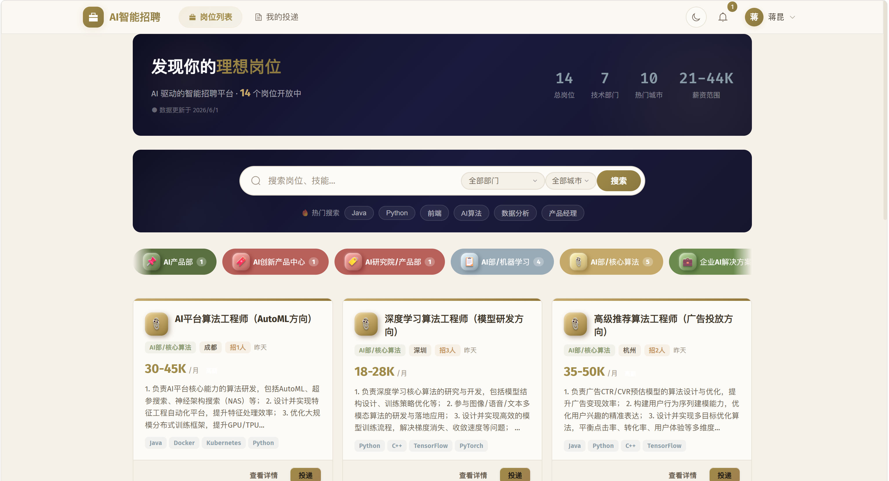

Card-based job listings with keyword search, department filtering, and pagination. Each card displays job title, department, salary range, and skill tags. Top navigation lets candidates quickly switch between browsing, applications, and interviews.

#### Job Detail & Application
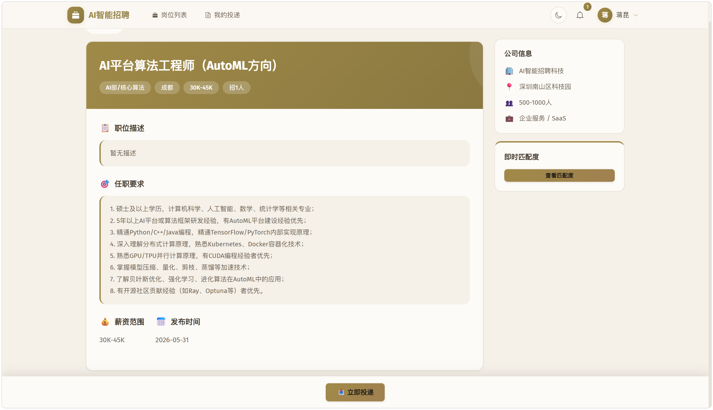

Full job detail page showing the complete JD, skill requirements, and compensation. The "Apply Now" button triggers a single-page application form with PDF/Word resume upload (base64 encoding), required fields for name, phone, email, and education.

#### AI-Powered Interview
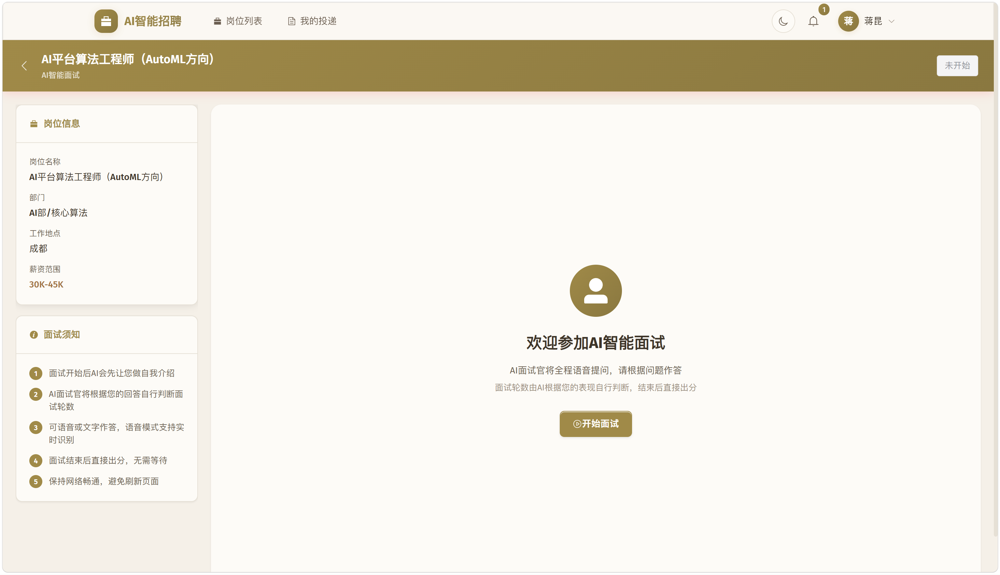

Full-screen interview interface: job info and guidelines on the left, conversation area on the right. AI automatically asks questions and scores responses, supporting both **text** and **voice** input. The top bar shows real-time round progress, duration, and answered count. The camera area integrates TensorFlow.js **behavior analysis** (face detection, posture recognition, attention assessment). AI interviewer voice narration via TTS.

#### Interview Report
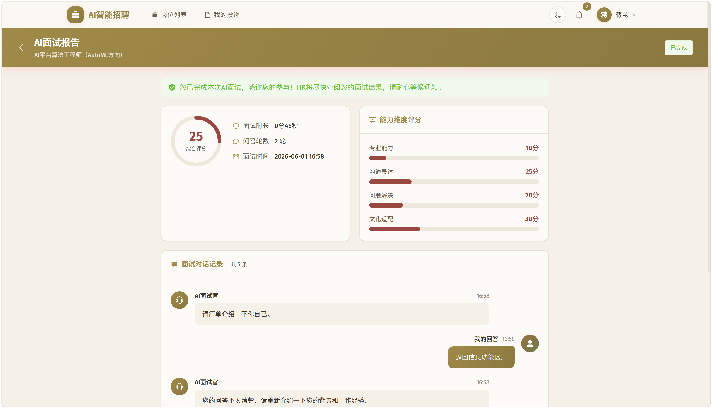

Instant radar chart scoring report generated after interview completion, covering four dimensions: **Professional Competence, Communication, Problem Solving, Cultural Fit**. Displays overall score, per-round conversation history, and AI evaluation comments.

#### My Applications
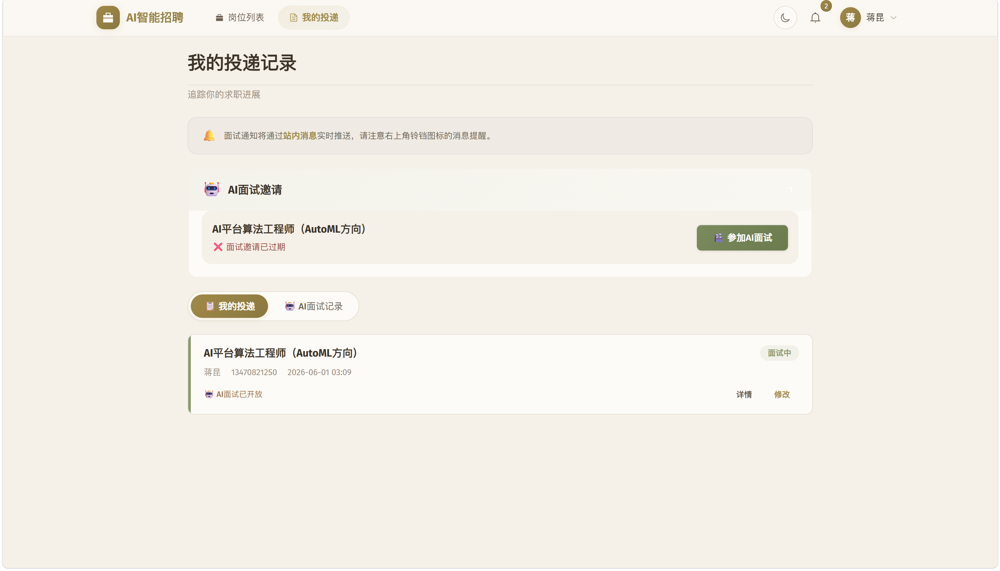

Dual-tab page — "My Applications" shows all delivery records with status flow (Pending → Reviewed → Interviewing → Onboarded → Rejected), with AI interview invitation cards highlighted at the top; "AI Interview History" shows completed/in-progress AI interviews with score rings, duration, and status tags.

#### Recommended Jobs
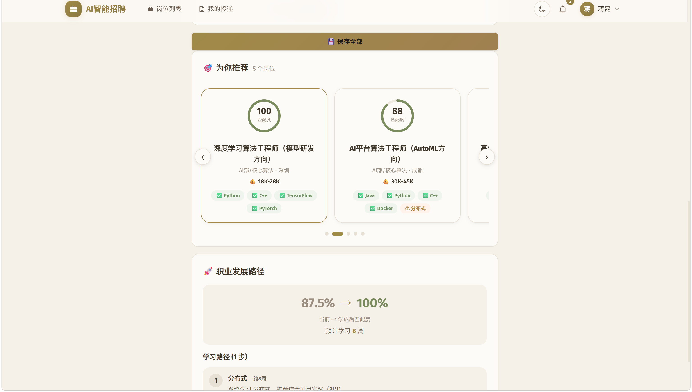

AI-powered recommendations based on candidate skills and application history. Horizontal scrolling cards, each featuring a **match percentage ring**, AI recommendation reason, and skill match tags.

### HR Management Portal

#### Dashboard
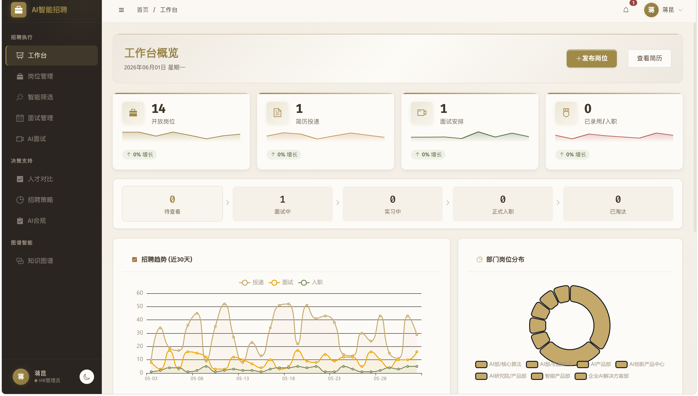

HR workspace homepage showing key metric cards (total jobs, applications, interview pass rate, monthly hires), recruitment funnel (Applied → Screened → Interviewed → Hired), and recent application activity timeline.

#### Job Management
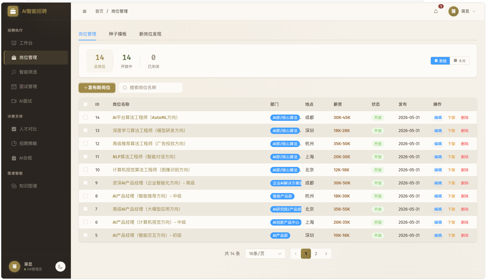

Job CRUD table with batch operations (publish/unpublish/delete), multi-condition filtering, and Excel import/export. Each job shows recruitment progress (application count / interview count / hire count).

#### Resume Management
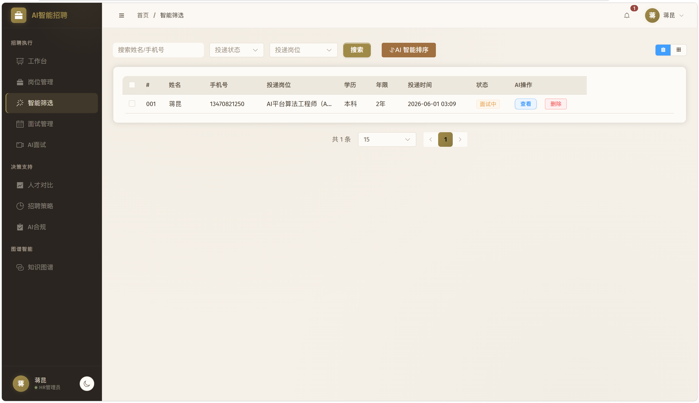

Application list filterable by job, status, and date. Each record displays candidate info, resume file preview, and AI-extracted skill tags. Supports batch resume download.

#### Smart Screening


AI auto-scoring and sorting page showing candidate-job match percentages, skill coverage, and experience fit. One-click interview invitation.

#### AI Interview Records
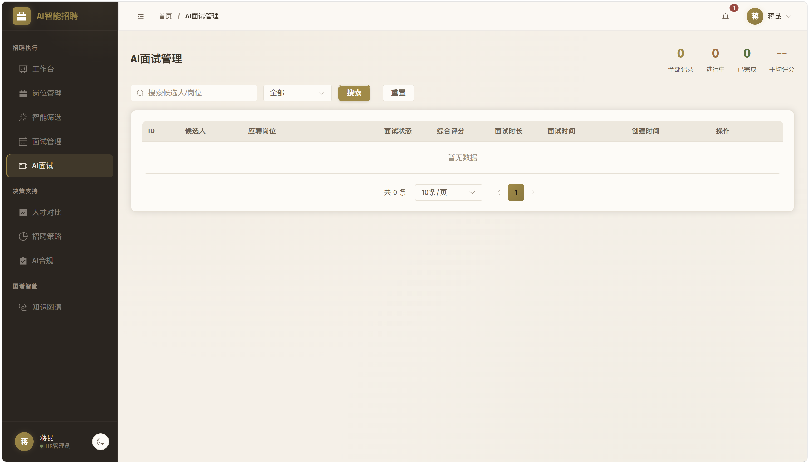

HR view of all candidates' AI interview records — candidate name, job, score, duration, status. Click to expand full conversation replay and four-dimensional scoring details.

#### Candidate Comparison
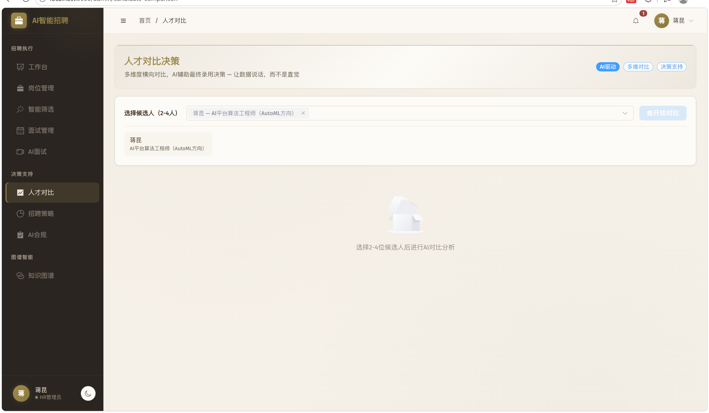

Multi-candidate side-by-side comparison view with overlaid skill radar charts and match score sorting for intuitive comparison of candidate strengths and weaknesses.

#### Knowledge Graph
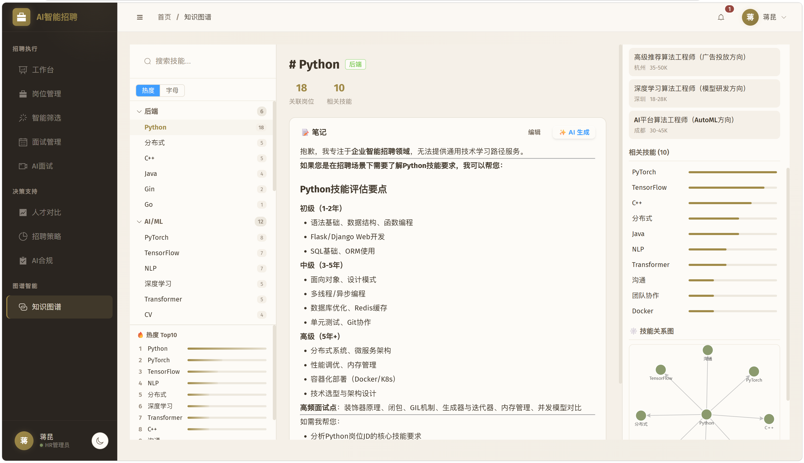

Neo4j-driven job-skill-candidate relationship graph rendered with G6 force-directed layout. Obsidian dark canvas style with claymorphism 3D glow nodes and skill particle flow animations. Supports drag, zoom, and click-to-detail. Shared across 4 admin pages (Knowledge Graph, Candidate Comparison, Resume Detail, Smart Screening).

#### Recruitment Strategy
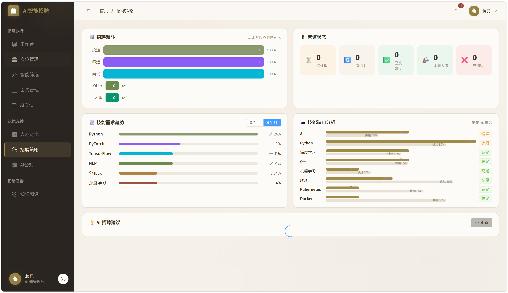

Funnel conversion analysis, channel effectiveness comparison, and time trend charts. Pipeline stage statistics (applicant count and conversion rate at each stage).

#### Compliance Audit
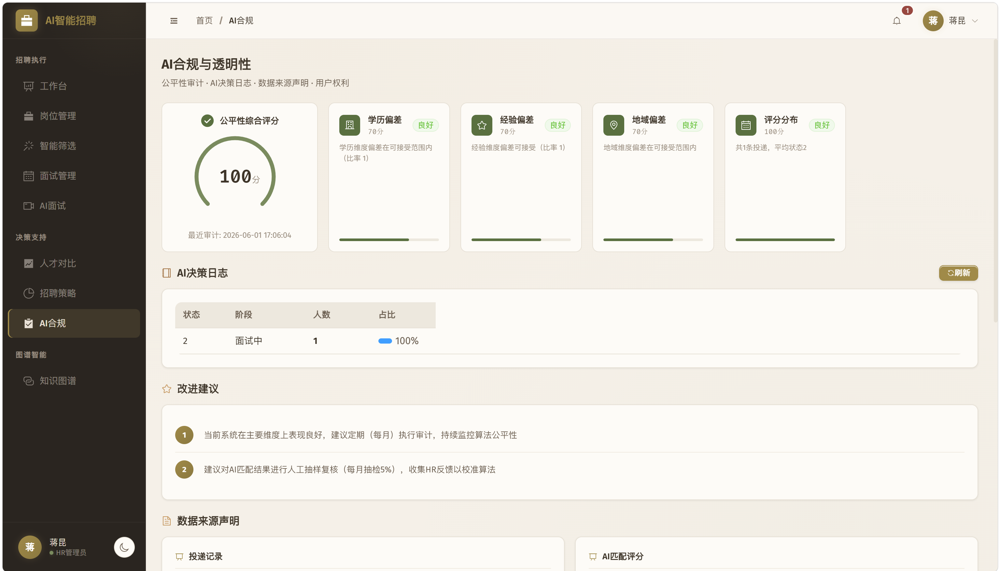

Recruitment compliance check page with fairness analysis metrics (gender ratio, age distribution, education composition) and data privacy compliance reports.

---

## Core Features

### 1. Candidate Portal

| Feature | Description |
|---------|-------------|
| Job Browsing | Card-based display with search, filtering, pagination, detail view, and skill requirements |
| Resume Submission | Single-page form, PDF/Word upload, base64 transfer |
| AI Interview | Multi-round conversational interview; AI auto-questions and scoring; text + voice dual mode |
| Speech Recognition | Browser Web Speech API + MiniMax ASR cloud dual-channel |
| TTS Narration | Interviewer voice narration via MiniMax TTS + browser fallback |
| Behavior Analysis | TensorFlow.js real-time face + posture detection (attention, gestures, expressions) |
| Interview Report | Instant radar chart report (Professional / Communication / Problem Solving / Cultural Fit) |
| Job Recommendations | Skill-matched AI recommendations, horizontal card layout with match reasons and skill tags |
| Profile Management | Candidate profile management, auto-persistence after resume upload |
| My Applications | Application record management, AI interview invitation cards + interview history |

### 2. HR Management Portal

| Feature | Description |
|---------|-------------|
| Job Management | Job CRUD, publish/unpublish, batch operations, template management |
| Resume Management | Resume viewing, filtering, batch download, status flow |
| Smart Screening | AI auto-scoring and sorting, resume-to-JD match analysis |
| Interview Management | Interviewer assignment, scheduling, full-process tracking |
| AI Interview Management | View candidate AI interview records, conversation replay, scoring details |
| Candidate Comparison | Multi-candidate horizontal comparison, skill radar charts, match sorting |
| Knowledge Graph | Job-skill-candidate relationship graph, G6 force layout, drag interaction |
| Recruitment Strategy | Funnel analysis, channel analysis, conversion rate dashboard |
| Compliance Management | Recruitment compliance auditing, fairness analysis, data privacy |
| Competitiveness Analysis | Candidate competition ranking, strength/weakness analysis |

### 3. Data Analytics & Competition Features

| Feature | Description |
|---------|-------------|
| Multi-Source Data Collection | Hangfire scheduled ETL, JD template-driven collection |
| Competency Graph | Neo4j entity-relationship modeling, skill tree + job network |
| Dynamic Evolution | Graph temporal snapshot comparison, skill trend analysis |
| New Job Discovery | AI-generated JD + knowledge graph entity disambiguation |
| Person-Job Matching | Semantic matching + graph path distance + multi-dimensional weighted scoring |
| Gap Analysis | Missing skill identification, learning path recommendations |
| Graph RAG | Knowledge-graph-based retrieval-augmented generation |
| Anti-Hallucination | AI output × graph fact cross-validation, quantified verification rate |
| Resume Parsing | AI structured extraction, skill tagging, automatic graph insertion |
| Accuracy Benchmarking | Automated benchmark testing, quantified match accuracy |

---

## Tech Stack

### Frontend
| Category | Technology |
|----------|------------|
| Framework | Vue 3 (Composition API + `<script setup>`) |
| Build | Vite 5 |
| UI Components | Element Plus + Custom Claymorphism Components (VBtn/VTag/VEmpty/VDialog) |
| State | Pinia (user / resume stores) |
| Router | Vue Router 4 |
| Graph | @antv/g6 (force-directed layout, 3D claymorphism nodes) |
| Charts | ECharts 5 |
| Behavior Analysis | TensorFlow.js (face-landmarks-detection + hand-pose-detection) |
| Voice | Web Speech API (STT) + Web Audio API (playback) |
| Language | TypeScript |
| Styling | SCSS + CSS Variables ("Soft Deep Space" theme) |

### Backend
| Category | Technology |
|----------|------------|
| Framework | .NET 9 Web API |
| ORM | Entity Framework Core |
| Auth | JWT (Bearer Token) |
| Realtime | SignalR |
| Scheduled Jobs | Hangfire |
| Message Queue | RabbitMQ |
| File Storage | MinIO |
| AI SDK | MiniMax API (chat / TTS / ASR) |
| ML | ML.NET (regression / classification / clustering) |
| Document Processing | EPPlus (Excel), Spire.PDF |

### Databases & Middleware
| Component | Purpose |
|-----------|---------|
| SQL Server | Primary business database (users, jobs, deliveries, interviews) |
| Neo4j | Knowledge graph (job-skill-candidate entity relationships) |
| Redis | Cache, session, notifications |
| MinIO | Resume files, avatars, object storage |

---

## Quick Start

### Requirements

- .NET 9 SDK
- Node.js 18+
- SQL Server (or LocalDB)
- Neo4j 5.x
- Redis (optional)
- MinIO (optional, for resume storage)

### 1. Clone

```bash
git clone https://github.com/jiangkun040919/agentic-hr.git
cd agentic-hr
```

### 2. Configuration

Edit `Backend/AIRecruitment.Api/appsettings.json`:

```json
{
  "ConnectionStrings": {
    "DefaultConnection": "Server=localhost;Database=AI_Recruitment;Trusted_Connection=true;TrustServerCertificate=true",
    "Neo4j": "bolt://localhost:7687",
    "Redis": "localhost:6379"
  },
  "AI": {
    "ApiKey": "your-minimax-api-key",
    "BaseUrl": "https://api.minimax.chat/v1"
  },
  "Minio": {
    "Endpoint": "localhost:9000",
    "AccessKey": "minioadmin",
    "SecretKey": "minioadmin"
  }
}
```

### 3. Initialize Database

```bash
# EF Core EnsureCreated runs on startup (create empty database first)
# Or run the SQL init script:
sqlcmd -S localhost -d AI_Recruitment -i SQL_Update_AI_Interview_Permission.sql
```

### 4. Start Backend

```bash
cd Backend/AIRecruitment.Api
dotnet run --urls "http://localhost:5001"
```

### 5. Start Frontend

```bash
npm install
npm run dev
```

Access:
- Frontend: http://localhost:3000
- Swagger API: http://localhost:5001/swagger
- Neo4j Browser: http://localhost:7474

### Docker (Optional)

```bash
docker-compose up -d
```

---

## Project Structure

```
agentic-hr/
├── Backend/
│   └── AIRecruitment.Api/
│       ├── Controllers/          # 33 API Controllers
│       │   ├── AuthController.cs          # Authentication (login/register/JWT)
│       │   ├── JobController.cs           # Job management
│       │   ├── DeliveryController.cs      # Application management
│       │   ├── AIInterviewController.cs   # AI interview (text + voice + TTS)
│       │   ├── InterviewController.cs     # Traditional interview management
│       │   ├── GraphController.cs         # Knowledge graph
│       │   ├── MatchController.cs         # Person-job matching
│       │   ├── MatchingV2Controller.cs    # Enhanced matching v2
│       │   ├── ResumeAiController.cs      # AI resume parsing
│       │   ├── StrategyController.cs      # Recruitment strategy analysis
│       │   ├── GraphRagController.cs      # Graph RAG
│       │   ├── AgentController.cs         # Multi-agent
│       │   ├── DataCollectionController.cs # Data collection
│       │   ├── StatController.cs          # Statistics
│       │   ├── NotificationController.cs  # Notifications
│       │   ├── FaceController.cs          # Expression analysis (Tencent Cloud)
│       │   ├── WorkflowController.cs      # Approval workflows
│       │   ├── SysConfigController.cs     # System configuration
│       │   ├── ComplianceController.cs    # Compliance auditing
│       │   ├── FairnessController.cs      # Fairness analysis
│       │   └── ...
│       ├── Services/              # 42 Business Services
│       │   ├── AIService.cs               # AI inference core
│       │   ├── AIInterviewService.cs      # AI interview logic
│       │   ├── KnowledgeGraphService.cs   # Neo4j graph operations
│       │   ├── MLMatchingService.cs       # ML.NET matching
│       │   ├── MultiAgentMatchingService.cs # Multi-agent matching
│       │   ├── GraphRAGService.cs         # Graph RAG retrieval
│       │   ├── GraphEvolutionService.cs   # Graph evolution
│       │   ├── EnhancedMatchingService.cs # Enhanced matching engine
│       │   ├── RecruitmentAgentService.cs # Recruitment agent
│       │   ├── JobDiscoveryService.cs     # New job discovery
│       │   ├── DataCollectionService.cs   # Data collection
│       │   ├── TemplateGenerationService.cs # Template generation
│       │   ├── ResumeAiService.cs         # AI resume parsing
│       │   ├── StatisticsService.cs       # Statistics
│       │   ├── DecisionIntelligenceService.cs # Decision intelligence
│       │   ├── FairnessAuditService.cs    # Fairness auditing
│       │   ├── HealthMonitorService.cs    # System health monitoring
│       │   ├── SignalRService.cs          # Realtime push
│       │   ├── HangfireServices.cs        # Scheduled tasks
│       │   └── ...
│       ├── Models/                # Data entities + DTOs
│       ├── Data/                  # EF Core DbContext
│       ├── Extensions/            # DI registration extensions
│       ├── Options/               # Strongly-typed configuration
│       └── Middleware/            # Middleware
├── src/
│   ├── views/
│   │   ├── public/               # Candidate Portal (9 pages)
│   │   │   ├── JobList.vue              # Job listings
│   │   │   ├── JobDetail.vue            # Job detail
│   │   │   ├── ResumeSubmit.vue         # Resume submission
│   │   │   ├── Login.vue / Register.vue # Authentication
│   │   │   ├── AIInterview.vue          # AI interview (camera + voice + chat)
│   │   │   ├── AIInterviewReport.vue    # Interview report (radar chart)
│   │   │   ├── MyDeliveries.vue         # My applications + interview history
│   │   │   └── CandidateProfile.vue     # Profile management
│   │   └── admin/                # Admin Portal (15 pages)
│   │       ├── Dashboard.vue            # Dashboard
│   │       ├── JobManagement.vue        # Job management
│   │       ├── ResumeManagement.vue     # Resume management
│   │       ├── SmartScreening.vue       # Smart screening
│   │       ├── InterviewManagement.vue  # Interview management
│   │       ├── AIInterviewManagement.vue # AI interview records
│   │       ├── CandidateComparison.vue  # Candidate comparison
│   │       ├── KnowledgeGraph.vue       # Knowledge graph
│   │       ├── RecruitmentStrategy.vue  # Recruitment strategy
│   │       ├── CompliancePage.vue       # Compliance management
│   │       ├── BenchmarkDashboard.vue   # Benchmark dashboard
│   │       └── ...
│   ├── components/
│   │   ├── ui/                   # Custom UI components (claymorphism style)
│   │   │   ├── VBtn.vue / VTag.vue / VEmpty.vue / VDialog.vue
│   │   ├── graph/                # Graph components
│   │   │   └── GraphCanvas.vue          # G6 force-directed graph
│   │   ├── interview/            # Interview components
│   │   └── ...
│   ├── api/                      # API wrappers (by module)
│   ├── stores/                   # Pinia stores
│   ├── utils/                    # Utilities + behavior analysis
│   └── router/                   # Route configuration
├── docs/
│   └── screenshots/              # Application screenshots
├── SQL_Update_AI_Interview_Permission.sql
├── docker-compose.yml
├── README.md
└── README_EN.md
```

---

## API Overview

### Authentication
| Method | Endpoint | Description |
|--------|----------|-------------|
| POST | `/api/auth/login` | User login |
| POST | `/api/auth/register` | User registration |
| GET  | `/api/auth/userinfo` | Get current user info |
| POST | `/api/auth/upload-resume` | Upload resume (base64) |
| PUT  | `/api/auth/profile` | Update profile |

### Jobs
| Method | Endpoint | Description |
|--------|----------|-------------|
| GET    | `/api/job/list` | Job list (search/filter/paginate) |
| GET    | `/api/job/{id}` | Job detail |
| POST   | `/api/job/create` | Create job |
| PUT    | `/api/job/{id}` | Update job |
| DELETE | `/api/job/{id}` | Delete job |

### AI Interview
| Method | Endpoint | Description |
|--------|----------|-------------|
| POST | `/api/ai-interview/start` | Start AI interview |
| POST | `/api/ai-interview/answer` | Submit answer |
| POST | `/api/ai-interview/end` | End interview |
| GET  | `/api/ai-interview/result/{sessionId}` | Get interview result |
| GET  | `/api/ai-interview/session/{sessionId}` | Session status |
| GET  | `/api/ai-interview/my-sessions` | My interview records |
| POST | `/api/ai-interview/speech-to-text` | Speech-to-text |
| POST | `/api/ai-interview/text-to-speech` | Text-to-speech |
| POST | `/api/ai-interview/voice-start` | Voice mode start |
| POST | `/api/ai-interview/voice-answer` | Voice mode answer |

### Knowledge Graph
| Method | Endpoint | Description |
|--------|----------|-------------|
| GET | `/api/graph/job-skill` | Job-skill graph |
| GET | `/api/graph/candidate-skill/{id}` | Candidate skill graph |
| GET | `/api/graph/search?keyword=` | Graph search |
| GET | `/api/graph/evolution?jobId=` | Graph evolution data |

### Matching
| Method | Endpoint | Description |
|--------|----------|-------------|
| GET | `/api/match/job/{jobId}` | Match candidates to job |
| GET | `/api/match/candidate/{id}` | Match jobs to candidate |
| GET | `/api/match/detail/{jobId}/{candidateId}` | Detailed match analysis |

---

## AI Interview System

The AI interview is the system's most distinctive feature — a fully automated multi-round interview:

### Highlights
- **MiniMax LLM-Driven**: AI auto-generates interview questions based on job requirements and candidate resume
- **Adaptive Rounds**: AI determines interview length autonomously based on answer quality (typically 5–10 rounds)
- **Four-Dimensional Scoring**: Professional Competence, Communication, Problem Solving, Cultural Fit
- **Dual-Mode Interaction**: Text input and voice input (Web Speech API + MiniMax ASR)
- **Voice Narration**: AI interviewer asks questions via TTS (MiniMax), with browser fallback
- **Behavior Analysis**: TensorFlow.js real-time face, posture, gesture, and attention detection
- **Instant Report**: Radar chart scoring report generated immediately after interview

### Interview Flow
```
Start → AI Self-Intro Question → Candidate Answer → AI Follow-up/Next → ... → AI Score → Report
    |                                                          |
    +--- Speech Recognition -- Behavior Analysis -- TTS ------+
```

---

## Knowledge Graph System

Neo4j-based job-skill-candidate triple knowledge graph:

### Entity Types
- **Job** — Job node (title, department, salary, JD)
- **Skill** — Skill node (name, category, popularity)
- **Candidate** — Candidate node (resume skill mapping)
- **Certificate** — Certification/qualification node

### Relationship Types
- `REQUIRES` — Job requires skill
- `POSSESSES` — Candidate possesses skill
- `RELATED_TO` — Inter-skill relationship
- `EVOLVED_FROM` — Skill evolution relationship

### Visualization
- @antv/g6 force-directed rendering
- Claymorphism 3D nodes, Obsidian dark canvas style
- Drag, zoom, and pan interaction
- Skill particle flow animation

---

## Competition Scoring Coverage

| Dimension | Weight | Implementation |
|-----------|--------|----------------|
| Completeness | 25% | Full-process coverage + 105 test JDs + 33+ APIs |
| Innovation | 30% | AI interview + behavior analysis + graph evolution + Graph RAG + anti-hallucination |
| Practicality | 30% | Complete recruitment workflow + AI screening + multi-portal + compliance |
| Documentation | 15% | Detailed README + API docs + competition report |

---

## Test Data

- 105 job JD test dataset (covering IT, finance, manufacturing, and more)
- 3 temporal snapshot versions for evolution comparison
- Automated accuracy evaluation endpoint
- Benchmark dashboard

---

## FAQ

### Port Conflict
Port 5000 is often occupied by Windows SYSTEM process. Backend uses **5001** instead. Frontend Vite proxy points to 5001.

### Login Session Lost on Refresh
JWT token is stored in localStorage, valid for 7 days. If sessions are lost, check that `Program.cs` doesn't have a stray `EnsureDeleted()` call.

### AI Interview Exit Without Completing
In-progress interviews are listed under "My Applications" — click to resume. Completed interviews generate scoring reports.

### Chinese File Paths
Chinese characters in project paths do not affect compilation or runtime. Use GBK encoding for shell operations.

---

## Team

- Competition: iFlytek "Challenge Cup"
- Topic: XH-202621
- Repository: https://github.com/jiangkun040919/agentic-hr

---

## License

MIT
